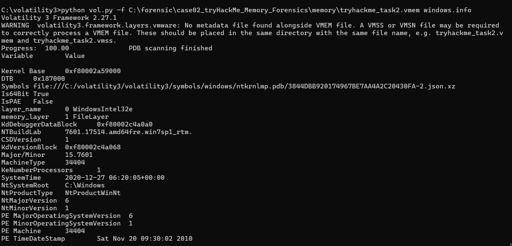
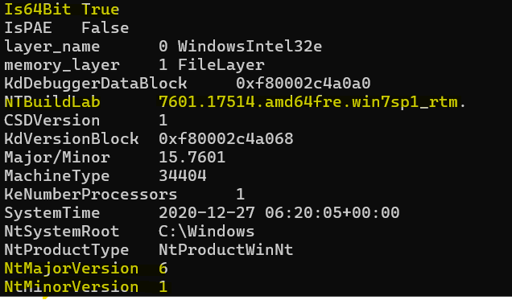
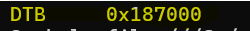
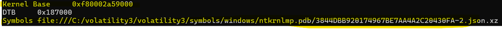
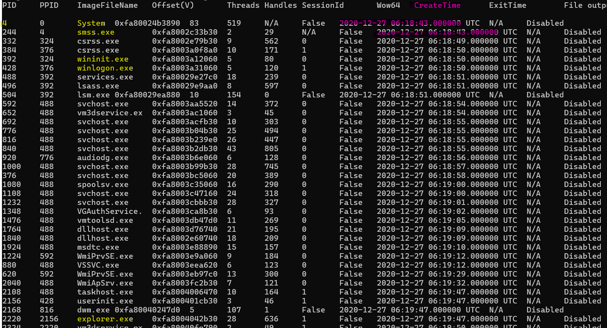
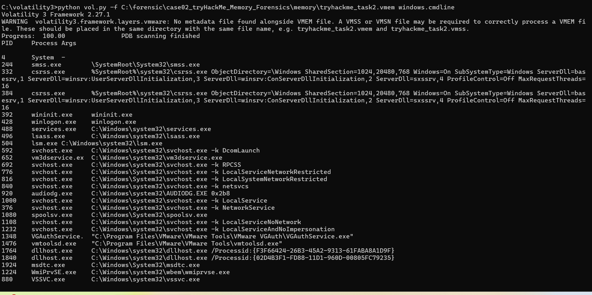
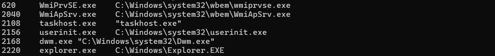
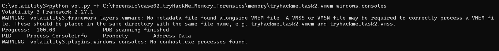
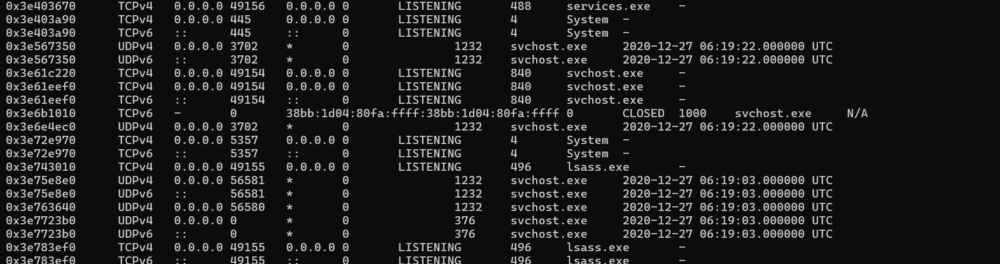
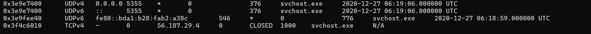

# Windows Memory Forensics: Normal System Behavior Analysis

Tryhackme에서 제공된 Windows 메모리 덤프를 대상으로 Volatility 3를 사용해 프로세스 실행 흐름, 사용자 명령 실행, 네트워크 통신 흔적을 분석하고
해당 덤프가 **정상적인 사용자 활동 기반 메모리** 임을 검증한 사례 분석 프로젝트

---

## 1. 프로젝트 개요 
본 프로젝는 TryHackMe에서 제공된 Windows 메모리 덤프 파일을 대상으로,
해당 메모리가 정상적인 사용자 활동 기반으로 생성된 덤프인지 여부를 검증하는 것을 목표로 한 메모리 포렌식 분석 사례이다.

Volatility3 프레임워크를 활용하여 
시스템 부팅 이후의 프로세스 실행 흐름, 사용자에 의해 실행된 명령 프롬프트 및 실행 이력, 외부 네트워크 통신 흔적 을 단계적을 분석했다. 

---

## 2. 분석 환경
- Host OS: Windows
- Python: 3.10.11
- Volatility Framework: 2.27.1
- Memory Dump Type: Windows 7 SP1 x64 메모리 덤프(VMware VMEM)

### 데이터 출처

- 메모리 덤프 출처: TryHackMe – Memory Forensics 실습 과제
- 제공 형태: Windows 메모리 덤프 (VMEM)
- 시나리오: 가상의 사용자(John) 환경에서 수집된 메모리 덤프
- 목적: 디지털 포렌식 분석 흐름 학습 및 사용자 행위 분석 연습 (해당 덤프는 교육 목적의 공개 자료)
- 참고 링크: [https://tryhackme.com/](https://tryhackme.com/room/memoryforensics)

---

## 3. 운영체제 정보 확인(windows.info)

volatility3의 *windows.info* 플러그인을 사용하여 
메모리 덤프에 포함된 운영체제 정보를 식별하였다. 

분석 결과, 대상 시스템은
**Windows 7 SP1 x64** 환경임을 확인하였다. 

해당 덤프에는 VMware 메타데이터 파일(VMSS / VMSN)이 제공되지 않았으나,
커널 및 DTB 식별이 정상적으로 이루어져 주요 Volatility 플러그인 분석은 문제없이 수행 가능하였다. 

---

## 4. 프로세스 분석(windows.pslist)

Volatility3의 *windows.pslist* 플러그인을 사용하여
메모리 상 실행 중인 프로세스 목록을 확인하였다. 

분석 결과, 
**System**(**PID4**)을 시작으로 
**smss.exe -> wininit.exe -> services.exe / lsass.exe** 로 이어지는
Windows 핵심 시스템 프로세스들이 
정상적인 부모-자식 관계와 생성 시간(create time)흐름을 유지하고 있음을 확인하였다.

또한 **winlogon.exe** 이후
**userinit.exe** 및 **explorer.exe**가 실행되어
정상적인 사용자 로그인 과정이 이루어졌음을 확인하였다.

---

## 5. 명령 실행 및 콘솔 흔적 분석

5.1 명령행 인자 분석(windows.cmdline)

Volatility3의 *windows.cmdline* 플러그인을 사용하여 
실행 중인 프로세스들의 명령행 인자를 확인하였다.

분석 결과, 
**cmd.exe**, **powershell.exe**와 같은 
명령 기반 프로세스는 확인되지 않았으며,
**svchost.exe**, **services.exe**, **lsass.exe** 등
주요 시스템 프로세스들은 모두
정상적인 경로 및 표준 실행 인자를 사용하고 있음을 확인하였다. 

이를 통해 본 메모리 덤프에서는 
사용자 또는 외부 공격자에 의한 명령 실행 흔적은 관찰되지 않았다.

5.2 콘솔 세션 분석(windows.consoles)

*windows.consoles* 플러그인을 사용하여
콘솔 세션 흔적을 확인한 결과,
**conhost.exe** 프로세스가 존재하지 않아 
콘솔 기반 명령 실행 흔적은 확인되지 않았다. 

---

## 6. 네트워크 흔적 분석(windows.netscan)

Volatility3의 *windows.netscan* 플러그인을 사용하여
메모리 상의 네트워크 연결 정보를 분석하였다. 

분석 결과, 
**System** 및 **svchost.exe** 등 
정상적인 Windows 서비스에 의해 생성된 
LISTENING 상태의 포트만 확인되었으며,
외부 IP와의 활성 연결(ESTABLISHED)은 발견되지 않았다.

이를 통해 본 메모리 덤프에서는
외부 공격자에 의한 비정상적인 네트워트 통신 흔적은
존재하지 않는 것으로 판단된다. 

---

## 7. 결론 및 분석 시 고려 사항

본 메모리 덤프 분석 결과, 
프로세스 구조, 명령 실행, 콘솔 사용, 네트워크 통신 전반에서 
침해 사고로 의심할 만한 흔적은 확인되지 않았다. 

본 분석은 
**정상 상태의 Windows 메모리 덤프를 기준으로
포렌식 분석 절차 및 판단 기준을 학습하기 위한 목적** 으로 수행되었다. 

또한 VMware VMEM 덤프의 특성상
메타데이터 파일 유무에 따라 분석 가능 범위가 달라질 수 있음을 고려하여,
메타데이터 의존도가 낮은 플러그인을 중심으로 
교차 검증을 수행하였다. 

